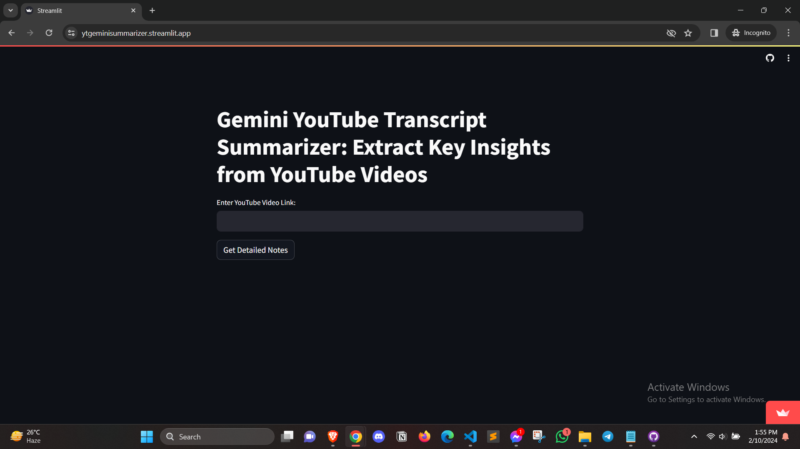

# Gemini YouTube Transcript Summarizer

Gemini YouTube Transcript Summarizer is a Python-based application that utilizes the YouTube Transcript API for transcript extraction and Google's Gemini Pro GenerativeAI for automatic summarization. This Streamlit app allows users to input YouTube video links and receive detailed summaries, enhancing accessibility and efficiency in accessing video content insights.

## Features

- Extracts transcripts from YouTube videos.
- Summarizes transcripts into concise summaries using Google's Gemini Pro GenerativeAI.
- Provides detailed notes with key insights and essential information.
- User-friendly interface with easy input of YouTube video links.

## Screenshot

## Getting Started

To run the application locally, follow these steps:

1. Clone this repository to your local machine.
2. Install the required Python dependencies listed in `requirements.txt` using `pip install -r requirements.txt`.
3. Set up your Google API key by creating a `.env` file in the root directory and adding your key:
4. Run the Streamlit app by executing the command `streamlit run app.py` in your terminal.
5. Access the Streamlit app in your web browser at `http://localhost:8501`.

## Dependencies

- `youtube_transcript_api`: Library for fetching transcripts from YouTube videos.
- `streamlit`: Framework for building interactive web applications with Python.
- `google_generativeai`: Library for accessing Google's Gemini Pro GenerativeAI.
- `python_dotenv`: Library for loading environment variables from `.env` files.
- `pathlib`: Library for handling file paths in an object-oriented way.

## Contributing

Contributions are welcome! Feel free to open an issue or submit a pull request with any improvements or bug fixes.

## License

This project is licensed under the [MIT License](LICENSE).
